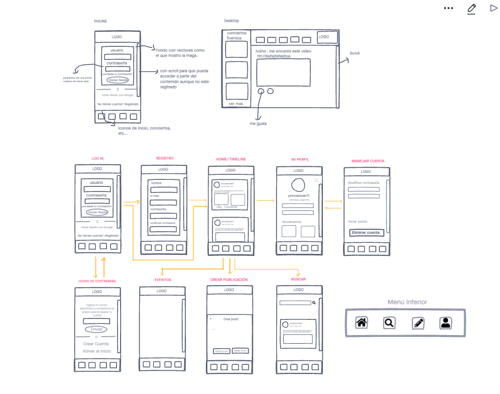
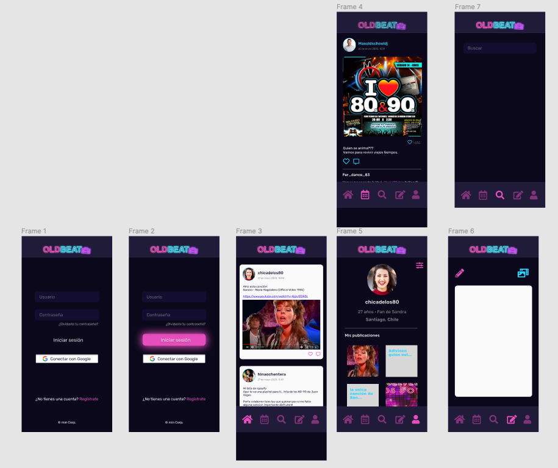
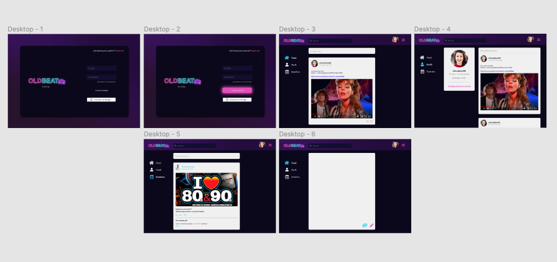
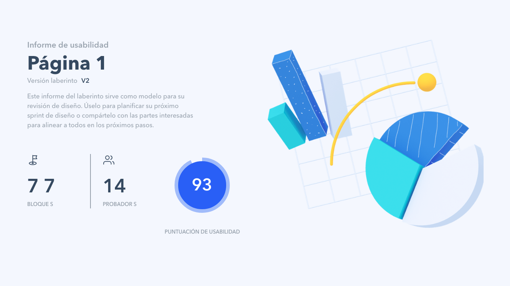
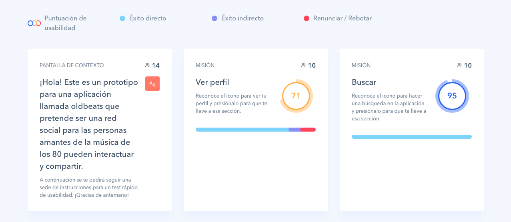
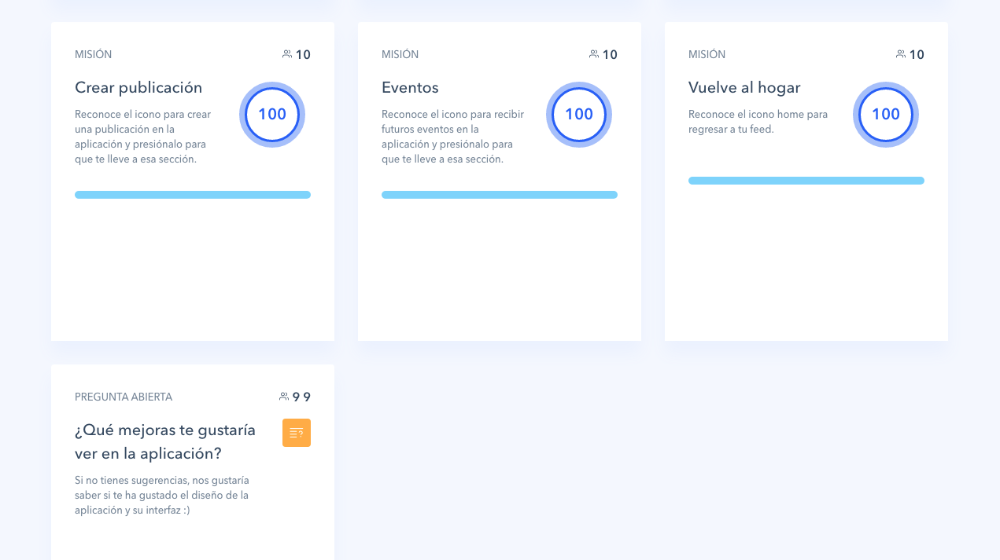

# Social Network OLDBEAT

## Índice

* [1. Resumen del proyecto](#1-Resumen-del-proyecto)
* [2. Objetivos](#2-Objetivos)
* [3. Historias de usuario](#3-Historias-de-usuario)
* [4. Decisiones de diseño](#4-Decisiones-de-Diseño)
* [5. Test de usuarios](#5-Test-de-usuarios)
* [6. Test unitarios](#6-Test-unitarios)

***

## 1. Resumen del proyecto
GitHub Page: https://niamoyano91.github.io/SCL013-social-network/

Deploy: https://niamoyano91.github.io/SCL013-social-network/src/index.html

## 2. Objetivos
## 3. Historias de usuario
######  Historia de usuario 1
A. Usuario ingresa a pantalla inicial y aparece la opción (botón) para registrarse.
B. Usuario completa formulario y se se envía correo de verificación a e-mail entregado.
######  Historia de usuario 2
A. Usuario ingresa a travez de cuenta de google.
B. Usuario puede recuperar contraseña por medio del link "olvidaste contraseña".
######  Historia de usuario 3
A.Usuario ingresa a Home y puede ver publicaciones de forma ascendente por fecha.
B.Usuario puede crear publicaciones(diferente disposición de elementos según dispositivo)
######  Historia de usuario 4
A.Usuario ingresa a su perfil , se pueden ver sus datos e historial de publicaciones.
######  Historia de usuario 5
######  Historia de usuario 6
######  Historia de usuario 7

## 4. Decisiones de Diseño
###### A. Prototipo en baja fidelidad
Prototipo en InVision(https://nia891374.invisionapp.com/freehand/socnet-fb448y9ac?v=Ow%2Be1YqDBIUICAi7%2BiSD2w%3D%3D&linkshare=urlcopied)

###### B. Prototipo en alta fidelidad

Prototipo Phone Figma (https://www.figma.com/file/MgBVAGEJVgf6wMHFCbi8HI/Social-Network-Phone?node-id=0%3A1)

Prototipo Desktop Figma (https://www.figma.com/file/0YXJVk1YoTndld263N9Keq/Social-Network-Desktop?node-id=1%3A3)

## 5. Test de usuarios

## 6. Test unitarios
